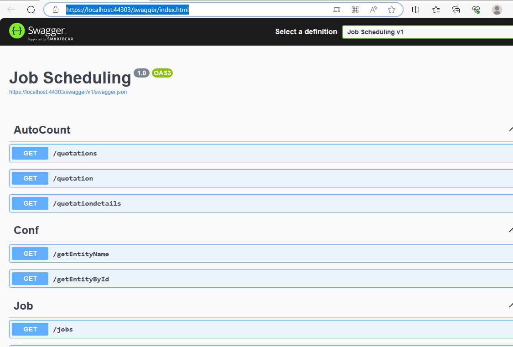
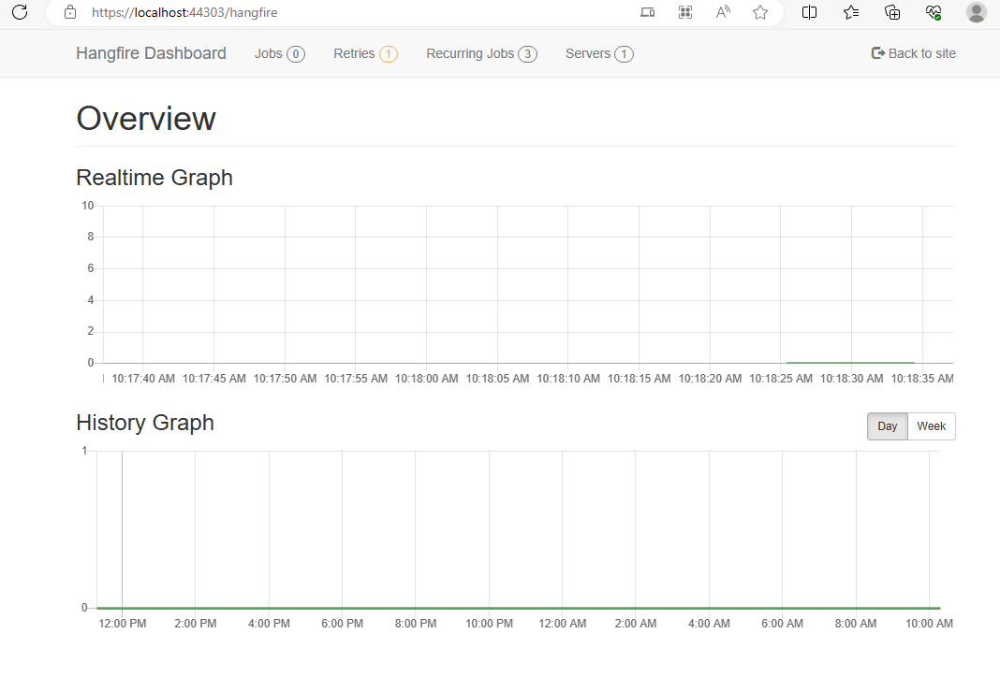
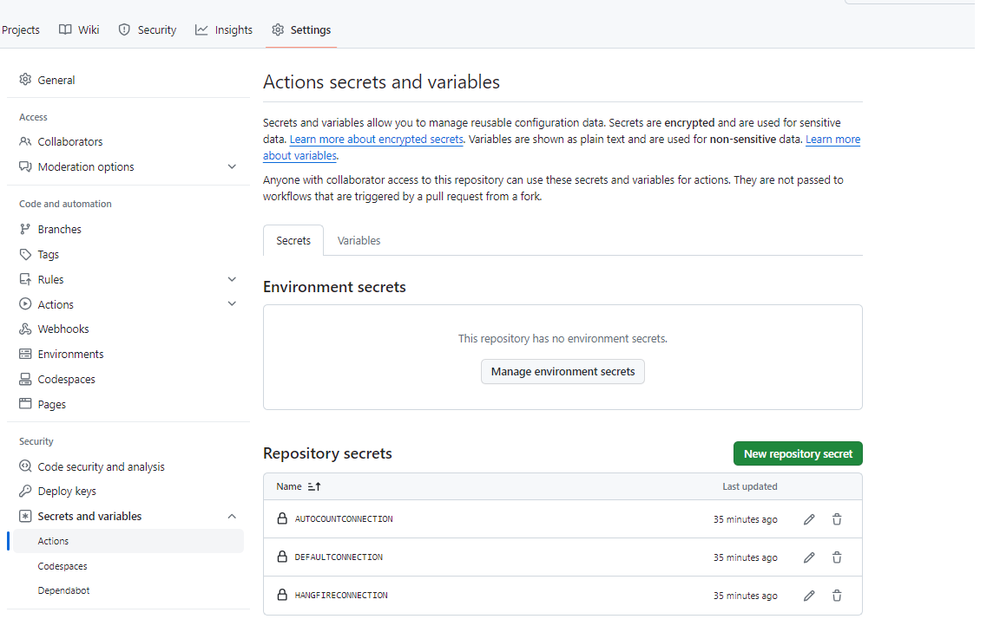

## Table of Contents
1. [Prerequisites](#prerequisites)
2. [Database Schema](#database-schema)
3. [Project Structure](#project-structure)
4. [Swagger](#swagger)
5. [Hangfire](#hangfire)
6. [Git Action](#git-action)

## Prerequisites
Development Setup
- .Net 6

Production Setup
- .Net 6
- .NET Core Hosting Bundle
- Visual C++ Redistributable
- IIS URL Rewrite

## Database Schema
https://dbdiagram.io/d/jobsys-6566fe393be1495787f47f9d

## Project Structure
```
├── Controllers
├── Database
├── Model
│   └──	AutoCount
├── appsettings
├── Program.cs
```
## Swagger
Swagger is primarily employed for API design, documentation, and testing.



Swagger only available on development environment, which can be access by http://localhost/swagger

## Hangfire
Hangfire is an open-source library for . NET that provides a simple way to perform background processing in your application. 
It allows you to run jobs (methods or functions) asynchronously and schedule them to run at a specific time or regularly.

There is 2 processes defined in program.cs:
1. schedulerRoute : to be run on daily 6pm (except Saturday) to schedule the job route for next day.
2. jobChecker : to run daily 1am to update project status from pending to active if project start date >= today.



Hangfire dashboard can access from http://localhost/hangfire (dev & production)

## Git Action
This project will be using Git Action for CD/CI. There is an deployment agent installed in production instance.

For this project it consist of 2 workflow:
1. Deploy CYC WS : Auto deploy code to production when code commit/merge to main branch.
2. Artifacts Cleanup : shedule to run every hour to clean artifacts file left after deployment.

Workflow can be trigger manually and check the status under Project Repository > Actions tab.

Connection string are stored on respository secret.
